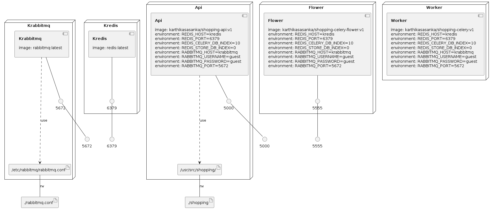

# fastapi - celery - rabbitmq - redis -> Docker


A simple docker-compose app for orchestrating a fastapi application, a celery queue with rabbitmq(broker) and redis(backend)


## build and run containers

```bash
docker-compose up -d --build
```

This will expose fastapi application on 5000 and celery flower on 5555

swagger docs - `http://localhost:5000/`

redoc - `http://localhost:5000/redoc`

celery flower - `http://localhost:5555`


### Infrastructure model

